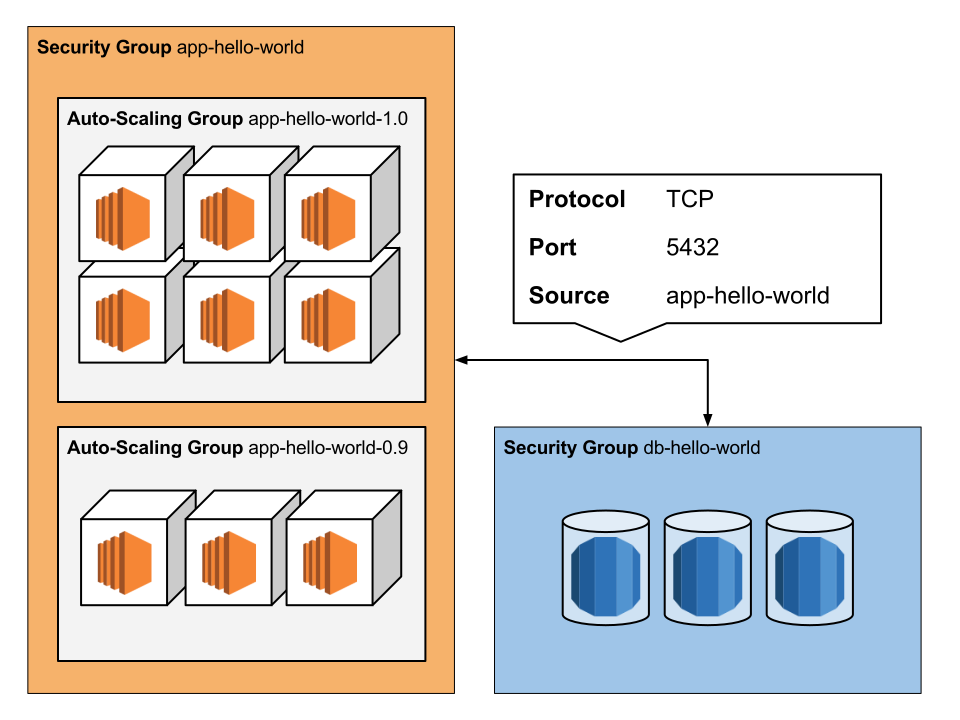
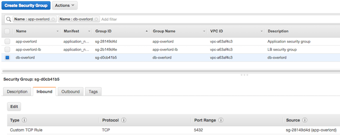

=================
Application Setup
=================

This section covers a typical application setup including different application versions, private data storage and
security groups. Make sure you read and understood the :doc:`network setup <network-setup>` as well as a basic
:ref:`application deployment <creating_an_application>`.

Minion will create a single security group per application and all instances, regardless of the version, will have
that security group assigned. Most applications will have some kind of data storage. Let's say we have an app
*hello-world* which uses a PostgreSQL server. Since the database is specific to that application and use usually not
shared with different applications and/or teams it's reasonable to limit the access to the database to our application:

.. source: https://drive.google.com/open?id=15hmU4amtwymUIHp1_hy-4BNrIDbKsbsdmoZEvSFdZEM&authuser=0

Security group not only allow access from and to specified IPs or IP ranges but also from and to other security groups.
This makes it extremely easy to set up an inbound rule in the *db-overlord* security group that allows `TCP` traffic
on port 5432 from the `app-overlord` security group:

Another benefit is that security groups are bound to your account, which means that there is no way that other (peered)
accounts access your private databases even though your VPCs are peered.
