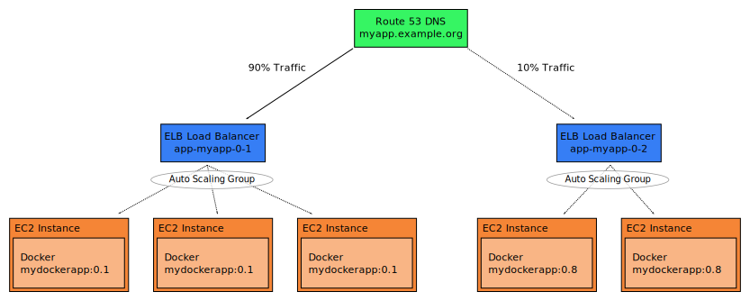

==============
Basic Concepts
==============

The AWS Minion allows managing application stacks of Dockerized applications.

Application
===========

An application is a abstract single deployable component providing TCP/HTTP endpoint(s).
An application is identified by its name (e.g. "myapp").

The following AWS resources are created per application:

* Security Group ("app-myapp"), allowing to restrict access to and from application instances.
* IAM Role, allowing to access other AWS services such as S3 without passing access keys
* DNS entry in Route 53 pointing to application version(s)

Application Version
===================

An application version represents a concrete deployable component using a specific Docker image, e.g. "myapp" version "1.0" using Docker image foobar/myapp:1.0.

The following AWS resources are created per application version:

* Auto Scaling Group
* ELB Load Balancer, allowing to access the specific application version directly

Application Instance
====================

An application instance is a concrete EC2 instance running a specific application version.
Application instances are automatically started by the version's auto scaling group.
