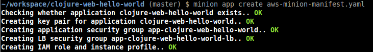
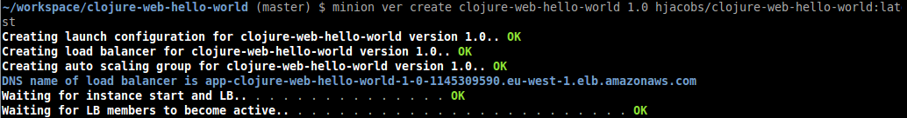
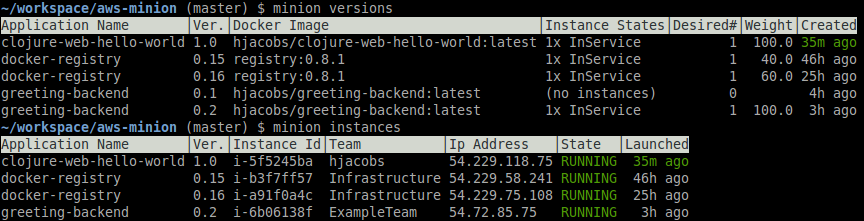

==========
Quickstart
==========

Prerequisites
=============

* AWS account with at least one VPC
* Route 53 hosted zone
* Recommended: Loggly account
* Python 3.4+ and PIP (``pip3``)

Installation
============

.. code-block:: bash

    $ pip3 install aws-minion

Configuration
=============

.. code-block:: bash

    $ minion configure

You need to enter:

* AWS credentials (if you haven't used ``aws`` CLI before)
* AWS region ID
* AWS VPC ID (might be autodetected)
* Route 53 domain name (might be autodetected)
* SSL Certificate ARN (optional, for HTTPS ELB)
* Loggly credentials (optional)

.. _creating_an_application:

Creating an Application
=======================

* Write application manifest as .yaml file (see `example manifest`_)
* Create/register application ``minion app[lications] create mymanifest.yaml``

  * This will create security group(s)
  * Registers application in registry (if there, right now storing manifest in tag on security group)

* Push Docker image to your favorite Docker registry
* Register application version ``minion ver[sions] create my-app 0.1 hjacobs/my-app`` (this would use Docker Hub)

  * This will create autoscaling group and ELB
  * Starts at least one instance (without getting traffic)

* ``minion ver[sions] traffic my-app 0.1 100``

  * Update DNS to point to version LB

.. _example manifest: https://github.com/zalando/aws-minion/blob/master/examples/myapp-manifest.yaml
